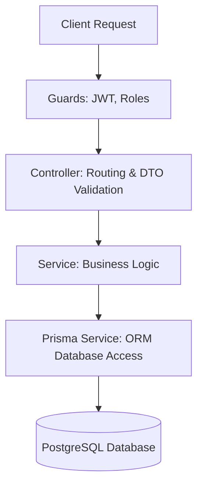
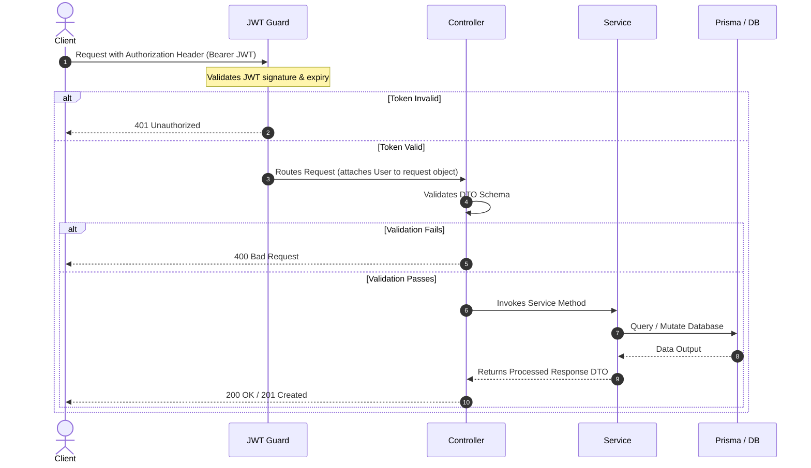
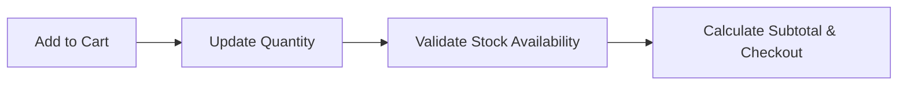

# NestJS & Prisma Full-Stack Project: Developer Guide & Roadmap

This document provides a high-level architectural overview, request flow guide, and roadmap of suggested new features with detailed implementation instructions.

---

## 1. High-Level Architecture Overview

The backend uses a standard NestJS modular architecture coupled with Prisma ORM and PostgreSQL. The application is organized by domain features under `src/modules`.



### Key Layers
1. **Controller Layer**: Handles incoming HTTP requests, maps routes, enforces DTO validation constraints using `class-validator`, and documents endpoints via Swagger (`@nestjs/swagger`).
2. **Service Layer**: Implements core business logic, handles exceptions (e.g., `ConflictException`, `NotFoundException`), and interacts with the database.
3. **Database Layer (Prisma)**: Prisma acts as the query builder and type-safe database layer. It leverages the multi-file schema feature using the `prismaSchemaFolder` configuration to organize model definitions.

---

## 2. Request Flow & Security

Here is how a request travels through the system when interacting with a protected endpoint:



> [!NOTE]
> The backend issues both a short-lived **Access Token** (15 minutes) and a long-lived **Refresh Token** (7 days). The refresh token is securely hashed (`bcrypt`) and saved to the database to support secure token rotation.

---

## 3. Recommended New Features Roadmap

Here are the suggested features to build next to complete the e-commerce engine, along with detailed implementation instructions.

### Feature 1: Complete the Products Module
Implement CRUD operations for products mapping to the schema defined in `api/prisma/product.prisma`.

#### Step-by-Step Implementation Instructions
1. **Create Products DTOs**:
   Add Create and Update Product DTOs in `api/src/modules/products/dto/`:
   * `create-product.dto.ts`: Should contain `name`, `description`, `price`, `stock`, `sku`, `imageUrl`, and `categoryId` with validation decorators.
   * `query-product.dto.ts`: Supporting pagination (`page`, `limit`), search queries, and filters (by `categoryId`, price ranges).

2. **Implement Products Service**:
   Write methods inside `products.service.ts` for database interactions:
   ```typescript
   import { Injectable, NotFoundException, ConflictException } from '@nestjs/common';
   import { PrismaService } from 'src/prisma/prisma.service';
   import { CreateProductDto } from './dto/create-product.dto';

   @Injectable()
   export class ProductsService {
     constructor(private prisma: PrismaService) {}

     async create(dto: CreateProductDto) {
       const existing = await this.prisma.product.findUnique({ where: { sku: dto.sku } });
       if (existing) throw new ConflictException('Product with this SKU already exists');
       return this.prisma.product.create({ data: dto });
     }

     async findAll(query: any) {
       // Support paginated queries, category filtering, and search options
     }
   }
   ```

3. **Expose Controller Endpoints**:
   Secure administrative actions (create, update, delete) using the `@UseGuards(JwtAuthGuard, RolesGuard)` and `@Roles(Role.ADMIN)` decorators. Keep read actions public.

---

### Feature 2: Cart and Checkout System
A system allowing authenticated users to add items to their cart, update quantities, and prepare for checkout.



#### Step-by-Step Implementation Instructions
1. **Create Cart Module**:
   Generate a new NestJS module:
   ```bash
   nest g module modules/cart
   nest g controller modules/cart
   nest g service modules/cart
   ```
2. **Key Methods to Implement in `cart.service.ts`**:
   * `addToCart(userId: string, productId: string, quantity: number)`: Checks if the cart exists (or creates a new one). Validates if the product stock is sufficient. Creates/updates `CartItem`.
   * `getCart(userId: string)`: Retrieves the active cart, joining product details, and calculates checkout total sums.
   * `updateQuantity(userId: string, cartItemId: string, quantity: number)`: Updates item count or deletes it if quantity is set to 0.

---

### Feature 3: Order Management & Payment Processing
Transition checked-out carts into formal orders and record completed transactions.

#### Step-by-Step Implementation Instructions
1. **Create Order Module**:
   Generate the module structure. Create orders linked directly to `Cart` and `User`.
2. **Order Lifecycle Flow**:
   * **Pending**: Created immediately upon checkout initiating.
   * **Processing**: Set after payment verification.
   * **Shipped / Delivered / Cancelled**: Controlled by admin endpoints.
3. **Simulate Payments**:
   Add a payments service integrating transaction records with status checks:
   * Map `Payment` schema records to verify transaction completions.
   * Integrate mock webhook logic to transition `OrderStatus` from `PENDING` to `PROCESSING`.

---

### Feature 4: Global Error Filters & Interceptors
To provide standardized error payloads for frontend integrations, implement a global exception filter.

> [!TIP]
> Standardizing responses reduces frontend parsing errors. Return a clean payload layout such as:
> `{ "statusCode": 400, "message": "Validation failed", "errors": [...], "timestamp": "..." }`

#### Step-by-Step Implementation Instructions
1. **Create Filter**:
   Create a custom exception filter at `src/common/filters/http-exception.filter.ts`.
2. **Register Globally**:
   Register it in `main.ts` using `app.useGlobalFilters(new HttpExceptionFilter())`.

---

## 4. Local Execution Reference

To run migrations and start the environment locally:

```bash
# Run migrations to update postgres DB structures
npx prisma migrate dev

# Generate Prisma Client
npx prisma generate

# Run backend development server
npm run dev
```
